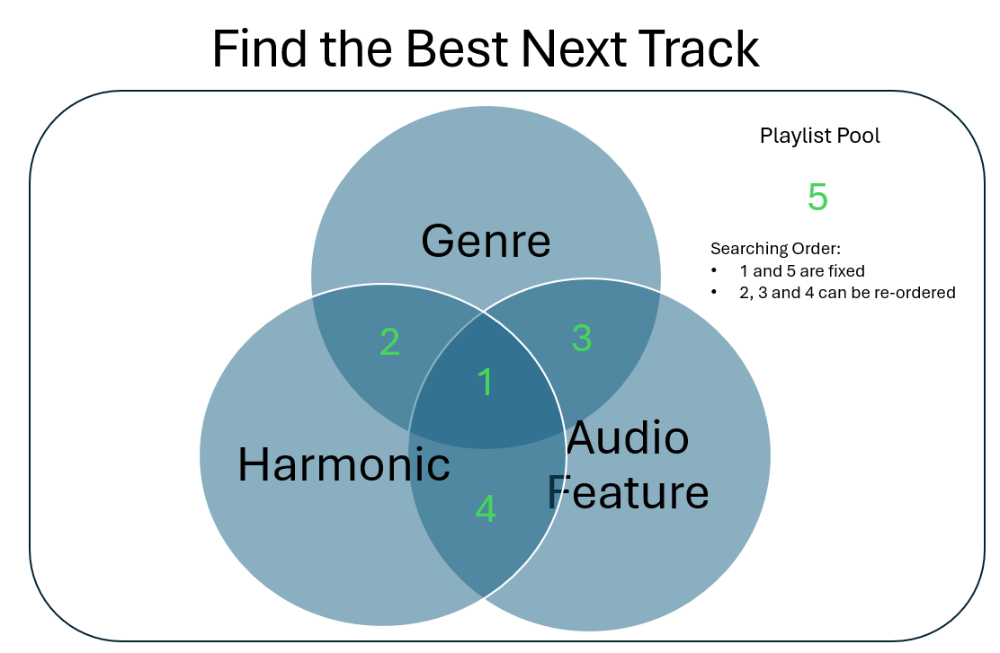
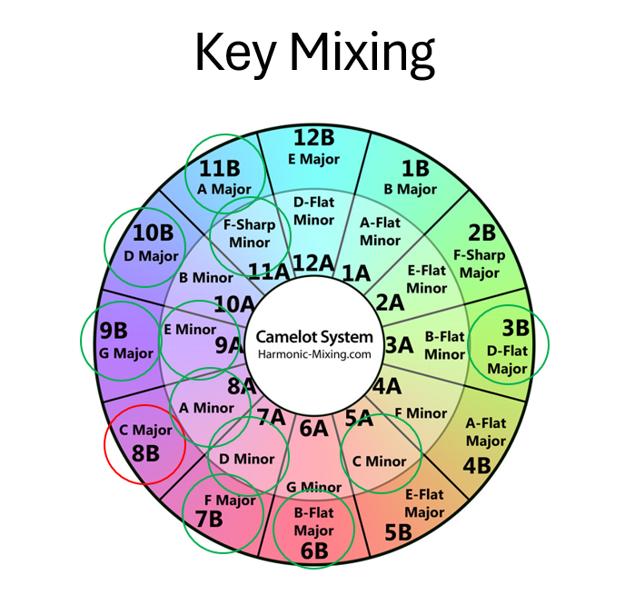

# Create your own awesome mixtape from Spotify Music, built by Quoc Anh Duong

## Description

A fun application that could help you create your own mixtape, DJ set or radio using your Spotify music library. Simply launch the [Jupyter Notebook Widget]('./exe.ipynb), import your Spotify playlist, select the track you want to start, and let the music begin!!!.

The music sorting algorithm is my own design, and the idea is simple: the next music track is selected by some common features it has with the previous track. From the pool of tracks imported from your Spotify music playlists, you could create a new playlist starting from your favorite track, and every subsequent track is the perfect match to the previous one. You could also apply some randomized selection to make it fun, and the mixtape is unique every time you run the application.

In addition to create an awesome playlist, you are also able to see some summary graphs of your playlist, and you could see how your music set is going to play out. And of course, you can export your playlist onto Spotify, and start listening right away!  

## Why use this app?

The more number of tracks and the more diverse the tracks are in your playlist, the more useful this application. 3 words: (1) Relevancy, (2) Similarity and (3) Curation.

In the sample playlist, there are 99 tracks from multiple genres. With that small dataset, it sometimes have trouble selecting the best tracks, and even the best next track sometimes doesn't make much sense to our musical ear because of the limited choices we provide. You would also question how this application is useful when you could do it yourself by hand and for sure produce a better playlist. But imagine you have hundreds of track in your depositorty. You can still create an awesome playlist, but you have to spend a lot of time. Now imagine thousands of tracks, you still can create an awesome playlist, but chances are you're picking those tracks from a biased POV, that you didn't actually go thru all thousands of tracks to pick the best one, but rather just pick a good one when you see one. Now imagine a million tracks, certainly it's impossible to do by yourself. But of course with millions of tracks the computation cost is very high. My point is, the sweet spot of using this app is when you have 100 to 10,000 tracks.

## Table of Contents

- [Get Started](#get-started)
- [Design](#design)
- [Content](#content)
  - [Spotify and Spotipy](#spotify-and-spotipy)
  - [Data](#data)
  - [Widgets](#widgets)
  - [Settings](#settings)
  - [How it works](#how-it-works)
    - [The Best Next Tracks](#the-best-next-tracks)
    - [Sort Playlist](#curate-the-playlist)
    - [Models](#models)
      - [Common Genre](#common-genres)
      - [Harmonic Keys](#harmonic-keys)
      - [Similarity](#similarity)
    - [Randomize Algorithm](#randomize-algorithm)
    - [Plots](#plots)
    - [Other Functions](#other-functions)
- [Usage](#usage)
- [Author's thoughts](#authors-thoughts)

## Get Started

To use the application, you could either use the [Jupyter Notebook Widget](exe.ipynb), which will launch the Jupyternotebook Widget, or dive into the actual code behind it using [Jupyter Notebook](test.ipynb). This notebook also includes more detail about the project, as well as de-bugging.

You might be required to install some Python [packages](./QuocAnh_py/others/install_packages.py). An embedded function to install some packages will be able to take care most of it. But if it doesn't, please follow the ImportError message and install the necessary packages.

You will also need to have token access from [Spotify Developer](https://developer.spotify.com/). Please visit Spotify website and request Developer token. Your credentials should be saved in the [Spotify Credentials](./spotify_cred.json) file.

For additional information about how to use Spotify Developer visit [here](https://medium.com/ryanjang-devnotes/handy-guide-to-spotify-api-spotipy-for-starters-5e4e05e1b0c7)

Before you begin, please note that you can add your playlist into the [playlist pool](./spotify_playlist_ids.csv). There is also a sample playlist listed in the file. You could simply go to a Spotify playlist, right click to copy its link, and paste into the csv file. Spotify only allows to pull 99 tracks in a playlist, so if you want to add more than *100* tracks, please use multiple playlists.

## Design

The modules are designed and organized in the best atomic fashion and optimal in which functionalities could be further added or removed without interfering others as much as possible. In addition, the funtionalities are grouped together based on their categories and purposes. Of course there are depedencies amongst the modules. In the future, I might attempt to re-organize it if needed.  

## Content

### [Spotify]((https://developer.spotify.com/)) and [Spotipy](https://spotipy.readthedocs.io/en/2.22.1/)

This project is possible thanks to [Spotify Developer](https://developer.spotify.com/) API and the Python library [Spotipy](https://spotipy.readthedocs.io/en/2.22.1/). This library contains functions that allows access to Spotify's database ([API](QuocAnh_py\spotify\spotify_api.py)) and to populatate the data ([crawling](QuocAnh_py\spotify\spotify_crawling.py)). And finally, [import the playlists' data and export it onto your Spotify account](QuocAnh_py\spotify\spotify_playlist_import_export.py)

At the core, every track, artist, album, and playlist have unique ID. The data is in unstructured data format, so I built functions to populate and convert them into readable dataframes.

In addition to that, spotipy also has a search function to return [a track Spotify data](QuocAnh_py\spotify\spotify_crawling.py) by using the track name, an optionally the artist name and album name.

### Data

Sample [Spotify data](./data/spotify_playlist_data.csv). The [Spotify Crawling](QuocAnh_py\spotify\spotify_crawling.py) and the [Import Module](QuocAnh_py\spotify\spotify_playlist_import_export.py) will populate the data from a list of playlist_id into a pd.DataFrame. The data includes:

- Track Data: track_id, track_name, key, mode, track_popularity, duration, danceability, energy, liveness, acousticness, speechiness, instrumentaliness, valence, tempo  
- Artist: artist_name, artist_id, artist_genres, artist_popularity
- Album: album_name, album_id, album_released
- Playlist: playlist_id, playlist_name, playlist_owner
- Additional: key_translated, duration_minutes, year_released [(created when playlist is imported)](data\spotify_playlist_data.csv). Energy and Mood translated [(created when harmonic keys model is applied)](QuocAnh_py/models/harmonic_keys.py)

For the track audio features listed above, plus the key, mode and track popularity, they are numerical values that describe a track. For example, a track popularity could be as popular as 90 and not so much at 50. A track key and mode represent the musical scale of the track, which will be used in the [Harmonic Keys](QuocAnh_py/models/harmonic_keys.py) model. Other metrics such as energy are from 0 to 1, the higher the value, the more 'energetic' the track is.

### [Widgets](./QuocAnh_py/execute/widgets.py)

The [Jupyter Notebook widgets](./QuocAnh_py/execute/widgets.py) is the front-end interactive application. Once you select the input, when you click 'Save Settings', it will overwrite the your settings into the [settings_manual.json](./settings/settings_manual.json) file (more information in the Settings content). The widget is then connected to the rest of the app using the [Main Class](QuocAnh_py\execute\widgets_to_main.py)

### [Settings](./settings/)

The [settings_default.json](./settings/settings_default.json) file is the default settings, in which the [settings_manual.json](./settings/settings_manual.json) will be copied and modified from.

- The app will automatically reads the settings from the manual file if it exists. The settings can be modified throught the [Jupyter Notebook Widget](exe.ipynb) after you click 'Save Settings'. If you select 'Show Advanced Settings', it will show the [settings_default.json](./settings/settings_default.json) content, and you could directly modify and save it there. And of course you could also modify directly in the file.
- To reset all the settings to default, simply delete the [settings_manual.json](./settings/settings_manual.json) file, or copy the default file to it.
- I will refer to the [settings_default.json](./settings/settings_default.json) in all the settings below.
- Some of the settings such as 'Harmonic Keys' and 'Randomize' have pre-determined input values, and then the option to apply which values into the application.

### How it works

The application will first access to Spotify database and populate the selected playlists. All the track data, including the artist and album data, will be combined into a data pool and processed from JSON to pd.DataFrame format. To avoid having to repeatedly accessing Spotify API, a local [Spotify data](./data/spotify_playlist_data.csv) version is saved in the project directory after the import process is successful.

Then, the application will reply on the Track Unique ID (track_id) to identify 'common' tracks and sort them. This application is built upon a single most important input: **the first track**. Since every track is selected based on the previous track, the 1st track is only going to influence the outcome of the 2nd track. There will be a chance that the 1st and 3rd track in the playlist could be very different, but they will both share common with the middle 2nd track.

When a track is selected into the new playlist, it will automatically be removed from the selection pool, thus guarantee that there will never be any repeated loop any duplications.

As of April 2024, the first track has to be included in the track pool. And all the subsequent tracks will be selected from the pool.

#### [The Best Next Tracks](./QuocAnh_py/dj/best_next_tracks.py)

At the current stage of the project as of April 2024, there are up to 3 models that could be used in the track selection process: (1) Common Genre, (2) Harmonic Keys, and (3) Audio Similarity.

Essentially, once an input track_id is selected, each model will carve out its own pool of common tracks based on the model criteria. You have the option to include/ exclude a model from the app by setting the 'applied in the [settings_default.json](./settings/settings_manual.json), under the models settings.

One important feature to mention is that the input track_id is always at top result in all models, as in theory the best fitted track is itself. Therefore, the input track_id is always in all the intersection results.

With that being said, the best next tracks output will return the intersection set of all models first, as shown in the set (1) figure above. In the event that the set doesn't have any other track_id other than the input track_id (basically len(set) needs to be greater than 1), it will return other set results (2), (3), and (4), from either a pre-determined or random order until len(set) > 1 is met. In the event that none of the set has length greater than 1, meaning no other track is suitable to be the best next track other than the input track itself, then a random track will be selected from the remaining un-used track pool, set (5).

In short, the search order of set (1) and (5) are fixed at the beginning and end, while order of set (2), (3), and (4) can be re-arranged. The order, named 'preferred order, is in the [settings_default.json](./settings/settings_manual.json). If applied = True, then it will apply the selection order. If applied = False, then the function will randomize the order.

The [Best Next Tracks](./QuocAnh_py/dj/best_next_tracks.py) pd.DataFrame output will subsequently be used as input in the [Sort Playlist](./QuocAnh_py/dj/sorting_playlist.py) algorithm. Visit the section for more information.

Finally, the Best Next Tracks output is a pd.DataFrame, where the indices are sorted by the [Nearest Neighbor](QuocAnh_py/models/nearest_neighbor.py) score. The first index should subsequently be the input track_id.

#### [Curate the Playlist](./QuocAnh_py/dj/sorting_playlist.py)

The Sort Playlist module is the next step from the 'Best Next Tracks' module. Together, they are the core engine of the application. Once a pool of best next tracks is determined, the Sort Playlist module will apply [randomization](./QuocAnh_py/others/randomize.py) feature and a length cap loop to add tracks into the output playlist pd.DataFrame.

With that being said, the playlist length is a required parameter. The Sort Playlist module is a while loop until the total length of the playlist is met. The default length is in [settings_default.json](./settings/settings_default.json).

#### Models

#### [Common Genres](QuocAnh_py/models/common_text_score.py)

Every Spotify track includes not only the track data, but also the artist, and the artist genre(s) (*not track genre!*). Each track will be associated with the main artist genres, and the algorithm will rank the tracks based on how common their genres are. This model is often referred throughout the project as 'Common Text Score'.

- Score Calculation: for example, track A's artist genres contain 'pop | rock pop' verus track B 'pop | contemporary pop | rock'. By default, firstly they both gain a score of 1 for having similar genre 'pop'. Secondly, the uncommon genres 'rock pop' and 'contemporary pop | rock' will be split into unique single word, and then the commons, 'rock' and 'pop', will earn a score of 0.5 (by default). And so in total the 'common text score' of these 2 tracks are 1 + 0.5*2 = 2.
- The higher the score, the more similar the tracks are assumed to be. Noted that this is the artist's genres, so it doesn't fully reflect the track's genres.
- Since the input track is required to be in the model's result, to make it the top result, a high artificial score will be used. Using the example above, the input track score is also going to be a 2, since both gernres 'pop' and 'rock pop' each get 1. This will make the sorting more difficult, and so an aritificial score is there to solve this. The default score is in the [settings_default.json](./settings/settings_manual.json).

#### [Harmonic Keys](QuocAnh_py/models/harmonic_keys.py)

Every Spotify track includes its musical scale. The algorithm relies on the DJ mixing guide from the [Camelot wheel](https://mixedinkey.com/camelot-wheel/) system. The Camelot wheel system a modern DJ technique system based on the [Circle of Fifths](https://www.musicca.com/circle-of-fifths) music theory that is easier for DJs to understand. In short, there are certain rules that a scale could follow to make the them harmonically sound.

- The Spotify data is written in the form of *key* and *mode*, in which the key is a number from 0 to 11, representing the key note in a piano keyboard, and the mode is either 0 or 1, indicating whether the scale is a Major or Minor. For example, (*key*, *mode*) (0, 1) is C Major.
- For easier translation, the track scale is converted to the [Camelot wheel](https://mixedinkey.com/camelot-wheel/) system, in which the musical scale is converted into number from 0 to 12, instead to C, C#, D, D#, etc. The mode is kept at 0 and 1, though the Camelot system uses A and B.
- For example, a track in C Major will harmonically sound well when transitioning to a track in G Major. In the Camelot Wheel, that is from a 8B to 9B. More example here:

- The harmonic scale rules are determined in the [settings_default.json](./settings/settings_manual.json). You have the option to include/ exclude which rules to apply.
- Per music theory, a change, or unchange, between songs' scales can lead to certain change in terms of *energy* and *mood*. The intepretation is predetermined in the [settings_default.json](./settings/settings_manual.json). For example, when a scale changes from a Major to a Minor, it is often a change from a Bright mood to a more Darken mood. Of course in actual songs, they don't always follow this rule as there are so many other things that could impact a song's 'mood'.

#### [Similarity](QuocAnh_py/models/nearest_neighbor.py)

Built from the machine-learning algorithm [Nearest Neighbor](https://scikit-learn.org/stable/modules/neighbors.html). This model is referred as Nearest Neightbor throughout the project. The idea is to find an observation's closest obersvation. It is an unsupervised learning model (no training data required), non-parametric, and the distance is calculated by standard [Euclidean distance](https://hlab.stanford.edu/brian/euclidean_distance_in.html) method.

- The sample size and the dimensions are pre-determined. The sample size is the number of tracks and the dimensions are as following: danceability, energy, acousticness, valence, tempo, and year released. These are data collected from Spotify. With that being said, one is considered a similar track to another when the distance between the 2 tracks' multi-dimensions are closest in totality. All the dimensions are equally weighted. As the result, one dimension's distance has to be very small to outweight the dissimilarity in other dimensions.
- When running this algorithm, the model will always return the input index in the result, with the Nearest Neighbor score of 0. The score is a positive numerical value, and it doesn't have a cap.
- In addition to a score, the model will also return a index order, or ranking. This is helpful in the track selection process. For example, when the final best next track selection is set, we can see the rank of that track in the Similarity result. It is often not the 2nd rank track (first rank is the input track_id) that will be selected, because the selection also depends on other models intersection tracks, and the randomization feature at the end. This data is also helpful for plotting. 
- It also has the parameter to return how many indices that are closest to the input. This input is available in the [settings_default.json](./settings/settings_manual.json).

It's often that when you look at the actual 2 'most simliar' tracks, and therefore the best next track of each other, they might be not what you expect. All the commonality algorithm here is to find the most similar in a systematic, data-driven way.  

#### [Randomize Algorithm](./QuocAnh_py/others/randomize.py)

The randomize module is applied in the sort playlist process. Essentially after the best next track_id pool is provided by the Best Next Track module, the Sort Playlist will apply this randomize feature to choose either (1) the optimal track or (2) randomly select one with either (i) equally or (ii) weighted sampling. In the [settings_default.json](./settings/settings_manual.json), this option is under the 'randomize' key.

- Applied = 0: Optimal Track. The optimal track is the second index in the Best Next Track output DataFrame, since the first index is the input track_id, and the second one is the one with the lowest and greater than 0 Nearest Neighbor score.
- Applied = 1. Equal Sampling. Basically choose a random track from the Best Next Track output.
- Applied = list: Weighted Sampling. This feature allows you to add 'favor' weight to the top indices in the Best Next Track output. For example, if the input is "[0.3, 0.2, 0.1]", then the top indices (sorted by Nearest Neighbor score) will get an additional weight listed there. The function will then standardize the weights again to make it equal to 1, and  the weights can now be interpreted as the 'percentages of being selected'. The function can handle all sizes of the pool. If the the list is longer than the number of indices, it will apply the same number of element in the list, and ignore the rest in the list.
- The function has the message_only option, this is for de-bugging and logging purpose.

#### [Plots](./QuocAnh_py/others/plots.py)

As of 04/2024, there are 4 plots that be generated from the application:

- Seasborn Pairplot: this plot serves mostly to understand the imported playlist data. It'll generate the scatterplot pairs of some pre-determined fields (found in [shortcuts](./QuocAnh_py/others/shortcuts.py)) as well as the distribution of the field. In addition, it could also highlight the input track_id so we can see where the input stands against the rest of the imported playlist
- Mathplotlib Histogram: this plot serves to understand the output playlist. It'll plot histograms of some pre-determined fields (found in [shortcuts](./QuocAnh_py/others/shortcuts.py)).
- Wordcloud Bubble: highlights the most common genres from a playlist.
- Plotly Multi-subplots: I often refer to this one as the 'Music Set Plot'. This plots serves to understand the output playlist in relation to time. This plot contains a lot of useful information for a 'DJ' to understand the playlist and how the playlist is going to play out.
  - The common x-axis is the time-series track duration by minutes.
  - There are 6 subplots in this plot. 5 of them are bar plots showing the 5 audio features from the playlist's track. The 6th plot is the line plot showing the Nearest Neighbor Score Index as well as the Common Text Score.
  - Refresh: the [Nearest Neighbor Score Index](./QuocAnh_py/models/nearest_neighbor.py) tells us how close the track is to the input track_id. This field is used instead of the actual Nearest Neighbor Score because the latter one doesn't have a cap value, whereas the former is simply integer. The smaller the number, the more similar the tracks are. As the result, when plotting, the Nearest Neighbor Score Index is *reversed* to negative values, so that the smaller the value, the higher it will show in the plot. This is for easier interpretation along side with the Common Text Score, where the higher the value, the more similar genres the tracks are.
  - In the barplots, the color represents the mood change. The mood change is interpreted from the Camelot movement from the [Harmonic Keys](./QuocAnh_py/models/harmonic_keys.py) result. The colors are pre-determined in the plot code. More information about the interpretation in the models section.
  - This plot is the most important plot out of all, and I would use this plot to evaluate the playlist. More information in the 'Usage' section.

#### [Other Functions](./QuocAnh_py/others/)

[Ultilities](./QuocAnh_py/others/utilities.py): contains functions that are used across the project or functions that aren't part of any particular module. One function worth mentioning is the top percentile, which is used in the model alogirthm to filter results. What the function does is picking the nth percentile (either largest or smallest depending on the models). This will help reduce the number of outcomes.

[Shortcuts](./QuocAnh_py/others/shortcuts.py): contains lists of variables that are frequently used in the project. This makes debugging and mantaining code easier, and a one-stop shop to review the variables being used throughout the projects.

## Usage

Let's pretend I'm invited to be my best friend's DJ for his wedding. Everyone is having a good time, and all the sudden, the groom walks over to the DJ booth, searches his pocket and hands me an USB, saying this is his awesome music compilations. He wants to show all the guests how awesome his music taste is. This is how I would do it using my application to create an awesome DJ set from that. Also, from here on, I shall replace the term playlist with music set, because it is now a performance.

First, I would use the Pairplot and WordBubble to understand the imported playlist, basically understanding my dataset from a data POV. Does this pool have similar tracks? Maybe a 'US Top-100 Pop' or 'Classical Music to Study' playlist? Or are all these tracks over the place, more like a 'Liked Songs' or 'Shazam' compilations where the user just saves down all the songs they like in a long span of time, from multiple genres. I personally do that xD.

Once I have a view of the track pools, I could understand the relationship of the input track and how the input track is going to drive the rest of the playlist. The more 'diverse' the track pool is, the more twists and turns I'm going to have with my own playlist. The less 'diverse' it is, the more 'on-theme' the playlist is going to be.

Once the playlist is created and returns the plots, a 'wannabe-DJ' like myself would want to understand how the 'pre-set' music is going to play out. The Histogram can show me quickly what tracks are in the new set. Are they mostly energic songs? Do they have the same tempo? Are they mostly in the same musical scales? Bascically, do they have the same 'vibe'?

Now to my favorite plot, and this is the output that I look at the most, as it basically tells me how well my music set is: the **Music Set Plot**. This plot shows minute by minute how your music is going to play out, just how a DJ would monitor this music while performing. With this plot, I could know ahead of time the sudden changes that happens in the playlist, or for example, when the music is going to take a turn from a bright dancy mood to a more melanchony mood. If I don't really like the music set created by the app, I could go back to change the initial input track, or play with some randomization instead of optimal if I want some twists and turns. In the future, I might add more features into customizing the music set.

A sudden change is not necessarily a bad thing in DJing, as long as you have a plan. For modern DJ music where the music is continuous rather than having intermissions, the listeners pay more attention to the current song, and how you transition it to the next song. That doesn't mean having a consistent 'vibe' is not important. As the matter of fact it really is, and that's also the point of using this application.

## Author's Thoughts

I had the idea for this ‘DJ’ project in summer of 2019. This project was originally one of my first Python projects when I started to learn coding and built my personal GitHub. After its last push in 2019, the project was left untouched.

Fast forward to April 2024, I revisited this project again and, using my coding experience learned from the past 5 years, improved it on every aspect. From refactoring to organizing the code into modules. From re-inventing the ‘DJ’ algorithm to adding more complex features. From providing detailed documentation to utilizing Jupyter Widgets to build a front-end application.

Looking back at my original 2019 code (archive folder) and to the current stage of the project as of April 2024, I could proudly say to myself that this was a worthy capstone project. For nearly a month, I completed this project during evenings and weekends while having a full-time job. This is by no means a ground-breaking project, but it's a personal one for me as it reflects how my coding journey has been.

## Additional Features in the Future

Here are the lists of additional features I could think of as of 04/2024

- More customization in creating the music set. I want to have a feature to customize the peak of an audio feature. For example, build up energy and then slowly drop it and raise it again.
- More sophisticated model: all 3 models as of April 2024 don't support 'favor' features. It'd be interesting to add weights into some Harmonic Keys more than others, or a particular audio features in Nearest Neighbor.